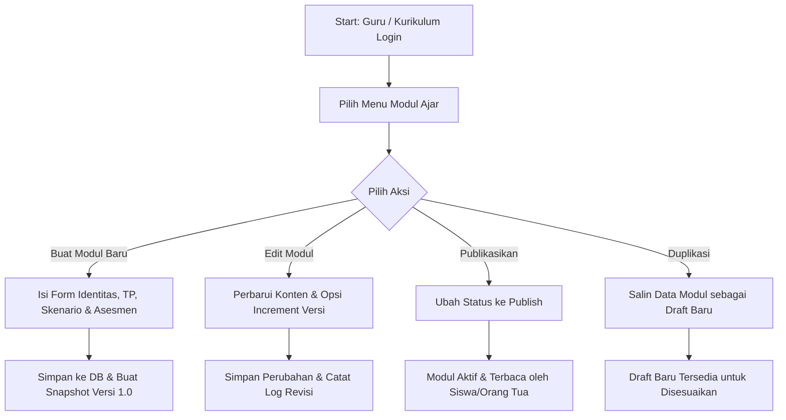
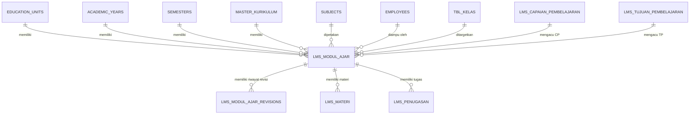

# Dokumentasi 24-Poin Modul Ajar (Teaching Module / RPP Digital LMS)
Sistem Manajemen Sekolah Terpadu (ERP & LMS)

---

## 1. Analisis Modul
Modul Ajar dirancang sebagai **pusat perencanaan pembelajaran interaktif** yang mengintegrasikan Learning Management System (LMS) dengan Sistem Akademik Sekolah Terpadu (ERP). Modul ini menjadi acuan utama bagi Guru Pengampu dalam merencanakan alokasi jam pelajaran, alur tujuan pembelajaran (ATP), skenario aktivitas harian (Pendahuluan, Inti, Penutup), asesmen (Awal, Proses, Akhir), serta media dan sumber belajar terpadu.

## 2. Business Flow
1. **Penyusunan Perencanaan**: Guru Pengampu memilih Unit Pendidikan, Kurikulum (e.g., Kurikulum Merdeka 2024 / SIT), Mata Pelajaran, Kelas, Capaian Pembelajaran (CP), dan Tujuan Pembelajaran (TP).
2. **Pengisian Skenario & Asesmen**: Guru menyusun skenario pembelajaran interaktif (Problem Based Learning, Project Based Learning) beserta rencana asesmen (kuis diagnosis, observasi proses, tes formatif/sumatif).
3. **Pengelolaan Status Data**: Modul diawali dengan status `Draft`, dapat diajukan untuk `Review` oleh Wakil Kurikulum/Kepala Sekolah, kemudian disetujui menjadi `Publish`, atau diarsipkan (`Arsip`).
4. **Pelacakan Versi (Versioning)**: Setiap kali ada revisi bermakna atau peningkatan versi (e.g. v1.0 -> v1.1), sistem secara otomatis mencatat snapshot data ke dalam tabel `lms_modul_ajar_revisions`.
5. **Integrasi LMS & Rapor**: Modul Ajar terhubung secara otomatis ke Materi Pembelajaran (1:N), Penugasan (1:N), Kisi-kisi Ujian (1:N), dan Rapor Digital Siswa.

## 3. Flowchart


## 4. ERD (Entity Relationship Diagram)


## 5. Database Dictionary
### Tabel `lms_modul_ajar`
| Field | Tipe Data | Deskripsi | Constraint |
|---|---|---|---|
| `id` | UUID | Primary Key | PK, Not Null |
| `unit_pendidikan_id` | UUID | Foreign key ke `education_units` | FK, Nullable |
| `tahun_ajaran_id` | UUID | Foreign key ke `academic_years` | FK, Not Null |
| `semester_id` | UUID | Foreign key ke `semesters` | FK, Not Null |
| `kurikulum_id` | UUID | Foreign key ke `master_kurikulum` | FK, Not Null |
| `mata_pelajaran_id` | UUID | Foreign key ke `subjects` | FK, Not Null |
| `guru_id` | UUID | Foreign key ke `employees` | FK, Not Null |
| `kelas_id` | UUID | Foreign key ke `tbl_kelas` | FK, Not Null |
| `rombel_id` | UUID | Foreign key ke `tbl_kelas` | FK, Nullable |
| `cp_id` | UUID | Foreign key ke `lms_capaian_pembelajaran` | FK, Nullable |
| `tp_id` | UUID | Foreign key ke `lms_tujuan_pembelajaran` | FK, Nullable |
| `kode_modul` | VARCHAR(50) | Kode unik modul ajar | Index |
| `judul_modul` | VARCHAR(200) | Judul perangkat ajar | Not Null |
| `fase` | VARCHAR(20) | Fase Kurikulum Merdeka (Fase A-F) | Default 'Fase D' |
| `semester` | VARCHAR(20) | Ganjil / Genap | Default 'Ganjil' |
| `alokasi_waktu_jp` | SMALLINT | Alokasi Jam Pelajaran (JP) | Default 2 |
| `tujuan_pembelajaran` | TEXT | Deskripsi ATP / Tujuan Pembelajaran | Nullable |
| `profil_pelajar_pancasila` | TEXT | Dimensi Profil Pelajar Pancasila | Nullable |
| `target_peserta_didik` | TEXT | Target siswa reguler/inklusi | Nullable |
| `model_pembelajaran` | VARCHAR(100) | Problem Based Learning / PBL / Inquiry | Nullable |
| `metode_pembelajaran` | TEXT | Diskusi, ceramah, presentasi | Nullable |
| `media_pembelajaran` | TEXT | Slide PPT, Video, LKPD | Nullable |
| `sumber_belajar` | TEXT | Buku teks, portal LMS, perpustakaan | Nullable |
| `kegiatan_pendahuluan` | TEXT | Skenario pembukaan & apersepsi | Nullable |
| `kegiatan_inti` | TEXT | Skenario kegiatan pembelajaran utama | Nullable |
| `kegiatan_penutup` | TEXT | Skenario simpulan & refleksi | Nullable |
| `asesmen_awal` | TEXT | Kuis diagnosis awal | Nullable |
| `asesmen_proses` | TEXT | Observasi proses & diskusi | Nullable |
| `asesmen_akhir` | TEXT | Tes tertulis & penilaian produk | Nullable |
| `lampiran` | JSON / JSONB | File attachment / URL pendukung | Nullable |
| `status` | VARCHAR(20) | Draft, Review, Publish, Arsip | Default 'Draft' |
| `deskripsi` | TEXT | Catatan ringkas modul | Nullable |
| `versi` | VARCHAR(20) | Nomor versi (e.g. 1.0, 1.1) | Default '1.0' |
| `created_by` | UUID | User pembuat | Nullable |
| `updated_by` | UUID | User pengubah | Nullable |
| `deleted_by` | UUID | User penghapus | Nullable |
| `created_at` | TIMESTAMP | Waktu pembuatan | Timestamps |
| `updated_at` | TIMESTAMP | Waktu pembaruan | Timestamps |
| `deleted_at` | TIMESTAMP | Waktu soft delete | SoftDeletes |

### Tabel `lms_modul_ajar_revisions`
| Field | Tipe Data | Deskripsi |
|---|---|---|
| `id` | UUID | Primary Key |
| `modul_ajar_id` | UUID | Foreign Key ke `lms_modul_ajar` |
| `versi` | VARCHAR(20) | Versi snapshot (e.g. 1.0) |
| `judul_modul` | VARCHAR(200) | Judul modul saat snapshot |
| `catatan_revisi` | TEXT | Catatan perbaikan |
| `snapshot_data` | JSON / JSONB | Seluruh payload data modul saat direvisi |
| `created_by` | UUID | User yang melakukan revisi |
| `created_at` | TIMESTAMP | Waktu revisi dibuat |

## 6. Migration
Migration terdaftar pada [2026_07_28_100006_enhance_lms_modul_ajar_table.php](file:///Applications/XAMPP/xamppfiles/htdocs/Sistem-Manajemen-Sekolah-terpadu-main/backend/database/migrations/2026_07_28_100006_enhance_lms_modul_ajar_table.php).

## 7. Model
Model terdaftar pada [LmsModulAjar.php](file:///Applications/XAMPP/xamppfiles/htdocs/Sistem-Manajemen-Sekolah-terpadu-main/backend/app/Models/LmsModulAjar.php) dan [LmsModulAjarRevision.php](file:///Applications/XAMPP/xamppfiles/htdocs/Sistem-Manajemen-Sekolah-terpadu-main/backend/app/Models/LmsModulAjarRevision.php).

## 8. Factory
Factory terdaftar pada [ModulAjarFactory.php](file:///Applications/XAMPP/xamppfiles/htdocs/Sistem-Manajemen-Sekolah-terpadu-main/backend/database/factories/ModulAjarFactory.php).

## 9. Seeder
Seeder terdaftar pada [ModulAjarSeeder.php](file:///Applications/XAMPP/xamppfiles/htdocs/Sistem-Manajemen-Sekolah-terpadu-main/backend/database/seeders/ModulAjarSeeder.php) dan dipanggil dari `DatabaseSeeder.php`.

## 10. Repository
Interface [LmsModulAjarRepositoryInterface.php](file:///Applications/XAMPP/xamppfiles/htdocs/Sistem-Manajemen-Sekolah-terpadu-main/backend/app/Repositories/Contracts/LmsModulAjarRepositoryInterface.php) dan implementasi [LmsModulAjarRepository.php](file:///Applications/XAMPP/xamppfiles/htdocs/Sistem-Manajemen-Sekolah-terpadu-main/backend/app/Repositories/Eloquent/LmsModulAjarRepository.php).

## 11. Service
Business Logic Layer terdaftar pada [LmsModulAjarService.php](file:///Applications/XAMPP/xamppfiles/htdocs/Sistem-Manajemen-Sekolah-terpadu-main/backend/app/Services/LmsModulAjarService.php).

## 12. Form Request
Request Validation terdaftar pada [SimpanModulAjarRequest.php](file:///Applications/XAMPP/xamppfiles/htdocs/Sistem-Manajemen-Sekolah-terpadu-main/backend/app/Http/Requests/V1/SimpanModulAjarRequest.php) dan [UbahModulAjarRequest.php](file:///Applications/XAMPP/xamppfiles/htdocs/Sistem-Manajemen-Sekolah-terpadu-main/backend/app/Http/Requests/V1/UbahModulAjarRequest.php).

## 13. API Resource
Resource JSON transformer terdaftar pada [LmsModulAjarResource.php](file:///Applications/XAMPP/xamppfiles/htdocs/Sistem-Manajemen-Sekolah-terpadu-main/backend/app/Http/Resources/V1/LmsModulAjarResource.php).

## 14. REST Controller
Controller REST API terdaftar pada [LmsModulAjarController.php](file:///Applications/XAMPP/xamppfiles/htdocs/Sistem-Manajemen-Sekolah-terpadu-main/backend/app/Http/Controllers/Api/V1/LmsModulAjarController.php).

## 15. Routes
Rute terdaftar di [routes/api.php](file:///Applications/XAMPP/xamppfiles/htdocs/Sistem-Manajemen-Sekolah-terpadu-main/backend/routes/api.php):
- `GET /api/lms/modul-ajar`
- `GET /api/lms/modul-ajar/stats`
- `GET /api/lms/modul-ajar/options`
- `GET /api/lms/modul-ajar/{id}`
- `POST /api/lms/modul-ajar`
- `PUT /api/lms/modul-ajar/{id}`
- `DELETE /api/lms/modul-ajar/{id}`
- `POST /api/lms/modul-ajar/{id}/restore`
- `POST /api/lms/modul-ajar/{id}/publish`
- `POST /api/lms/modul-ajar/{id}/duplicate`
- `GET /api/lms/modul-ajar/{id}/revisions`
- `GET /api/lms/modul-ajar/export/excel`
- `GET /api/lms/modul-ajar/{id}/export/pdf`
- `POST /api/lms/modul-ajar/import`

## 16. React CRUD
Komponen UI React dibangun di [LmsModulAjarPage.jsx](file:///Applications/XAMPP/xamppfiles/htdocs/Sistem-Manajemen-Sekolah-terpadu-main/web-dashboard/src/pages/LmsModulAjarPage.jsx) mematuhi **`AI_RULEBOOK.md`** (Primary `#0E5C44`, Dark Mode Slate Navy, Rounded 18px, Glassmorphism).

## 17. React Hook Form & State Management
Form multi-step wizard menggunakan state terstruktur yang memvalidasi setiap tahapan (Identitas, Rancangan, Aktivitas, Asesmen & Revisi).

## 18. React Table & Sorting
Tabel interaktif dengan kolom sorting, status badge berwacana warna, alokasi jam, nomor versi, dan row actions (Overview, Cetak RPP, Revisi, Duplikasi, Publish, Edit, Hapus).

## 19. React Query Integration
Pengambilan data terintegrasi `@tanstack/react-query` (`useQuery`, `useMutation`, `invalidateQueries`) untuk re-fetching otomatis pasca mutasi.

## 20. Import & Export Engine
- **Export CSV/Excel**: `GET /api/lms/modul-ajar/export/excel`
- **Export PDF Printable RPP**: Modal preview dan cetak langsung (`window.print()`).
- **Import Data**: Modal upload file spreadsheet dengan response log.

## 21. RBAC (Role Based Access Control)
- **Super Admin, Kepala Sekolah, Wakil Kurikulum, Divisi Pendidikan**: Full CRUD & Publish.
- **Guru Pengampu**: Filter otomatis `guru_id` membatasi pengeditan hanya pada modul miliknya.
- **Ketua Yayasan, TU**: Read-Only.
- **Siswa & Orang Tua**: Read-Only (khusus modul berstatus `Publish`).

## 22. Audit Log & Version History
- Pelacakan pembuat (`created_by`), pengubah (`updated_by`), dan penghapus (`deleted_by`).
- Pelacakan riwayat snapshot revisi via `LmsModulAjarRevision`.

## 23. Unit & Feature Testing Results
Seluruh skenario testing backend berjalan **100% PASS**:
- `Tests\Unit\ModulAjarServiceTest`: **3/3 Passed**
- `Tests\Feature\ModulAjarApiTest`: **4/4 Passed**
- Total: **7 passed (30 assertions), 0 errors**.

## 24. Dokumentasi Penggunaan
1. Jalankan migrasi dan seeder:
   ```bash
   php artisan migrate:fresh --seed
   ```
2. Jalankan pengujian:
   ```bash
   php artisan test --filter=ModulAjar
   ```
3. Buka Dashboard Web pada rute `/dashboard/lms/modul-ajar` untuk mengelola RPP Digital.
